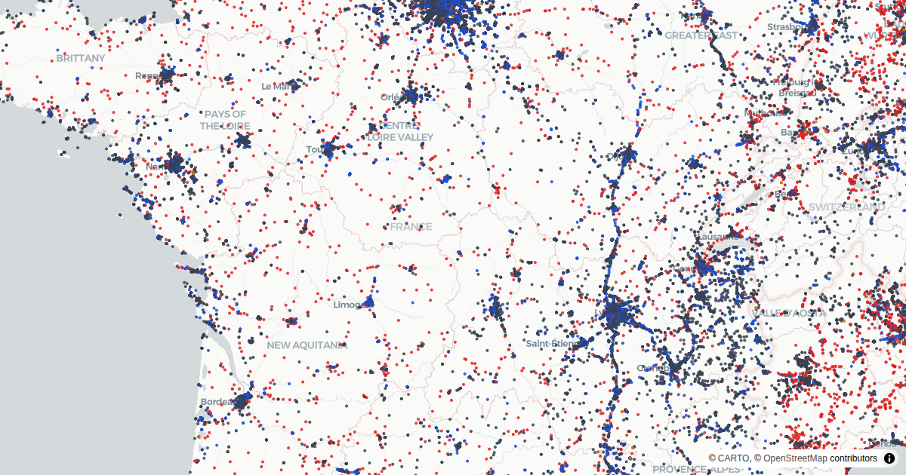
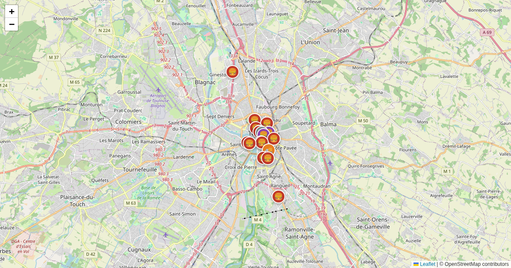
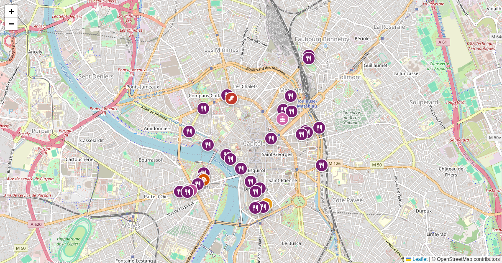

# Travel Guide

A Hugo-powered travel guide with interactive maps, starting with Koh Samui.

Live site: https://alx.github.io/travel-guide/

## Adding Locations to the Map

Locations are stored in `static/koh-samui/locations.geojson` as GeoJSON features.

### Adding a location via the map UI

1. Open the Koh Samui page
2. Click **+ Add a location** in the sidebar
3. Fill in the name, category, and coordinates (paste a Google Maps URL to auto-extract coordinates)
4. Copy the generated JSON from the output box

### Adding a location to the GeoJSON file

Paste the copied JSON into `static/koh-samui/locations.geojson` inside the `"features"` array:

```json
{
  "type": "Feature",
  "properties": {
    "name": "My Place",
    "category": "Restaurant",
    "address": "123 Beach Road, Lamai, Koh Samui",
    "notes": "Great pad thai, open from 11am–10pm"
  },
  "geometry": {
    "type": "Point",
    "coordinates": [100.0529, 9.4747]
  }
}
```

**Coordinates format:** `[longitude, latitude]` (GeoJSON standard)

**Available categories:** `Beach`, `Restaurant`, `Activity`, `Hotel`, `Shopping`, `Kids`, `Other`

### Getting coordinates from Google Maps

1. Open Google Maps and find the location
2. Click the location — the URL will contain `@lat,lng,zoom`
3. Or paste the Google Maps URL into the "Add a location" modal — it extracts coordinates automatically

## Creating Maps with Claude Code

Install the travel-guide skills once:

```bash
npx skills@latest add alx/travel-guide
```

Then in any Claude Code session inside this repo:

```
/create-map      — scaffold a new static POI map (slug, title, location, categories)
/publish-map     — enrich coordinates, commit, and deploy to GitHub Pages
```

## Sub-projects

Data pipelines and tools under [`scripts/`](scripts/). Each links to its own README.

| Preview | Project | Description |
|---|---|---|
|  | [711_samui](scripts/711_samui/README.md) | 7-Eleven stores on Koh Samui via Google Places API → GeoJSON |
|  | [airbnb_env](scripts/airbnb_env/README.md) | CLI: family-friendly POIs near an Airbnb listing |
|  | [airbnb_web](scripts/airbnb_web/README.md) | Flask wizard that turns an Airbnb listing into a neighbourhood map |
|  | [bangkok-citywalk](scripts/bangkok-citywalk/README.md) | Bangkok city-walk map with Wikimedia photos + Remotion video |
|  | [bangkok-raco](scripts/bangkok-raco/README.md) | Weekly Bangkok RA.co event maps with artist media curation |
| | [ci](scripts/ci/README.md) | GeoJSON validation + map preview screenshots for CI |
|  | [france_project_newsletter](scripts/france_project_newsletter/README.md) | Newsletter pipeline monitoring France's strategic industrial projects |
| | [google_places_api](scripts/google_places_api/README.md) | Food & drink venue ingester → HTML map, GeoJSON, optional PR |
| | [hooks](scripts/hooks/README.md) | Git pre-push hook ensuring og:image previews exist |
| | [raco](scripts/raco/README.md) | RA.co GraphQL area scanner (raw event data) |
| | [reddit](scripts/reddit/README.md) | Reddit thread → GeoJSON map via NER geocoding |
|  | [revente-tickets-fr](scripts/revente-tickets-fr/README.md) | r/ReventeTicketsFR ticket-resale tracker: Reddit → Telegram → map |
|  | [surat-thani-koh-samui-transit](scripts/surat-thani-koh-samui-transit/README.md) | Surat Thani ↔ Koh Samui transit itinerary map |
|  | [temple-walk](scripts/temple-walk/README.md) | Self-guided temple walking tours (Overpass + OSRM + Wikimedia) |
|  | [toulouse-distorama](scripts/toulouse-distorama/README.md) | Toulouse underground events pipeline with rendered videos |
|  | [videoprotection_toulouse](scripts/videoprotection_toulouse/README.md) | Toulouse CCTV & radar map from OpenStreetMap |
|  | [videosurveillance_france](scripts/videosurveillance_france/README.md) | France-wide CCTV & radar map from OpenStreetMap |
|  | [yoga_france](scripts/yoga_france/README.md) | Yoga places in France from OpenStreetMap |

### Utility scripts

| Preview | Script | Description |
|---|---|---|
| | [compact-geojson.py](scripts/compact-geojson.py) | Converts `locations.geojson` to compact columnar `locations.min.json` |
| | [fetch_all.sh](scripts/fetch_all.sh) | Refreshes all OSM-sourced datasets, then rebuilds the map index |
| | [generate_map_index.py](scripts/generate_map_index.py) | Scans content + GeoJSON stats into `data/maps.json` for the homepage |
| | [geocode_france_projets.py](scripts/geocode_france_projets.py) | Geocodes France strategic industrial projects CSV → GeoJSON |
|  | [toulouse_burgers_lookup.py](scripts/toulouse_burgers_lookup.py) | Google Places lookup → [toulouse-burgers](https://maps.girard-davila.net/toulouse-burgers/) map |
|  | [toulouse_mange_bien_lookup.py](scripts/toulouse_mange_bien_lookup.py) | Google Places lookup → [toulouse-mange-bien](https://maps.girard-davila.net/toulouse-mange-bien/) map |

## Development

```bash
# Install Hugo (v0.147.0+)
# https://gohugo.io/installation/

# Run local dev server
hugo server --buildDrafts

# Build for production
hugo --minify
```

## Deploy

Pushes to `main` automatically deploy via GitHub Actions to GitHub Pages.

## Contributing

1. Fork the repo
2. Add your locations to `static/koh-samui/locations.geojson`
3. Open a pull request

All contributions welcome — especially local tips, hidden gems, and family-friendly spots.
