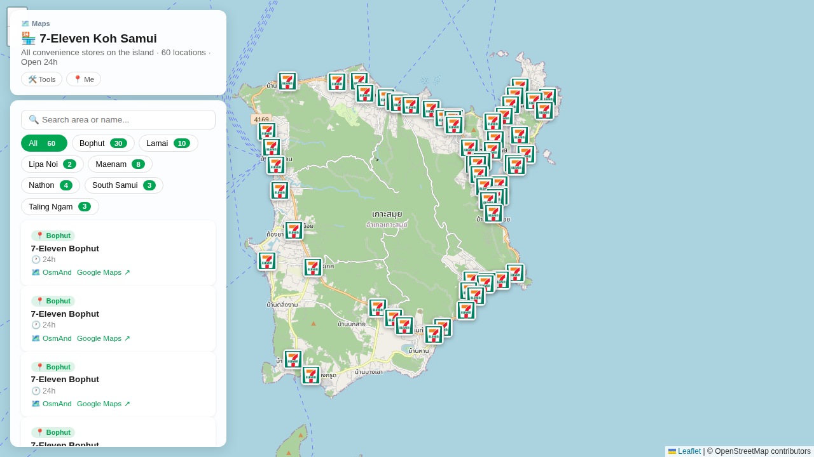

# scripts/711_samui



Fetches all 7-Eleven stores on Koh Samui from the Google Places API (New) and outputs GeoJSON.

## `fetch_711_samui.py`

The island is split into a 3×2 grid of bounding boxes to stay under the API's 60-results-per-query cap. Results are deduplicated by `place_id` across grid cells.

### Prerequisites

- Google Cloud project with the **Places API (New)** enabled
- `GOOGLE_MAPS_API_KEY` environment variable set

### Usage

```bash
export GOOGLE_MAPS_API_KEY=AIza...
uv run scripts/711_samui/fetch_711_samui.py > static/711-samui/locations.geojson
```

Progress logs go to stderr; GeoJSON goes to stdout.

### Output schema

Each feature in the FeatureCollection has:

| Property | Example | Notes |
|---|---|---|
| `id` | `samui-711-001` | Sequential |
| `name` | `7-Eleven Chaweng` | Area appended when detected |
| `category` | `Convenience` | Always |
| `icon` | `🏪` | Always |
| `area` | `Chaweng` | Parsed from Google address components |
| `hours` | `24h` / `check hours` | |
| `brand` | `7-Eleven` | Always |
| `place_id` | `ChIJ...` | Google place ID |
| `coord_source` | `google_places` | Always |
| `coord_accuracy` | `high` | Always |

No external Python packages required — stdlib only (`urllib`, `json`).
