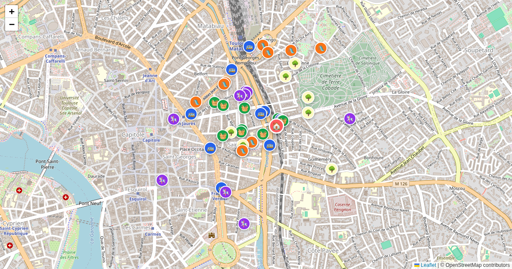

# scripts/airbnb_env



Find family-friendly POIs near an Airbnb listing: supermarkets, parks, playgrounds, transit stops, and kid activities.

## `airbnb_nearby.py`

Self-contained PEP 723 script — dependencies (`requests`, `python-dotenv`, `rich`, `beautifulsoup4`) are declared in the file header and installed automatically by `uv run --script`.

### Prerequisites

- `uv` installed
- *(optional)* Google Cloud project with the **Places API (New)** enabled, for Google Places fallback
- `.env` file in this folder (or the repo root):

```
GOOGLE_MAPS_API_KEY=AIza...    # optional — enables Google fallback
```

### Finding the Google Maps URL

On the Airbnb listing page, click **"Show on map"** in the host section. The embedded Google Maps URL contains the exact coordinates in the `?ll=` parameter:

```
https://www.google.com/maps?ll=4.588657,101.095776&z=16&t=m&hl=fr&gl=FR&mapclient=apiv3
```

Pass this as `--gmaps` for the most accurate results.

### Usage

```bash
# Recommended: both URLs — exact coords from gmaps, listing link from Airbnb
uv run --script scripts/airbnb_env/airbnb_nearby.py \
  https://www.airbnb.fr/rooms/1612148974271274765 \
  --gmaps "https://www.google.com/maps?ll=4.588657,101.095776&z=16&t=m&hl=fr&gl=FR&mapclient=apiv3"

# Airbnb URL only — script scrapes the page to find coordinates (less reliable)
uv run --script scripts/airbnb_env/airbnb_nearby.py \
  https://www.airbnb.fr/rooms/1612148974271274765

# Manual coordinate override (use if scraping fails)
uv run --script scripts/airbnb_env/airbnb_nearby.py \
  https://www.airbnb.fr/rooms/1612148974271274765 \
  --lat 4.5887 --lon 101.0958

# GeoJSON output (pipe-able to static/<slug>/locations.geojson)
uv run --script scripts/airbnb_env/airbnb_nearby.py \
  https://www.airbnb.fr/rooms/1612148974271274765 \
  --gmaps "https://www.google.com/maps?ll=4.588657,101.095776&z=16" \
  --output geojson > output.geojson

# Specific categories, 500m radius
uv run --script scripts/airbnb_env/airbnb_nearby.py \
  https://www.airbnb.fr/rooms/1612148974271274765 \
  --gmaps "https://www.google.com/maps?ll=4.588657,101.095776&z=16" \
  --radius 500 --categories supermarket,playground
```

### Arguments

| Argument | Default | Description |
|---|---|---|
| `airbnb_url` | required | Airbnb listing URL — embedded as listing link in all output formats |
| `--gmaps URL` | — | Google Maps URL from Airbnb host map — preferred coordinate source |
| `--radius` | `1000` | Search radius in metres |
| `--output` | `table` | `table`, `json`, or `geojson` |
| `--categories` | all | Comma-separated: `supermarket,park,playground,transit,activities` |
| `--lat` / `--lon` | — | Coordinate override — skips all URL-based extraction |
| `--no-google` | off | Disable Google Places fallback even if API key is set |
| `--env FILE` | auto | Path to `.env` credentials file |

**Coordinate resolution priority:** `--lat`/`--lon` → `--gmaps ?ll=` → Airbnb page HTML scraping.

### POI categories

| Key | Label | What it finds |
|---|---|---|
| `supermarket` | 🛒 Supermarket | Supermarkets, grocery stores, convenience stores |
| `park` | 🌳 Park | Parks and gardens |
| `playground` | 🛝 Playground | Children's playgrounds |
| `transit` | 🚌 Transit | Bus stops, bus stations, train/tram stations |
| `activities` | 🎠 Activity | Museums, aquariums, theme parks, swimming pools, sports centres |

### Output formats

**`table`** (default) — formatted terminal output grouped by category with distances.

**`json`** — single JSON object with `listing_url`, `coordinates`, `radius_m`, `generated`, and `results` keyed by category.

**`geojson`** — standard GeoJSON `FeatureCollection` matching the travel-guide schema. Each feature has `name`, `category`, `icon`, `coord_source`, `coord_accuracy`, and `listing_url` properties. Pipe directly to `static/<slug>/locations.geojson`.

### Notes

- Airbnb intentionally shows only an approximate location (~150 m accuracy) on its public map. The `--gmaps` URL from the host page embed tends to be more precise.
- OSM Overpass is the primary data source (free, no key required). Google Places is queried as a supplement when `GOOGLE_MAPS_API_KEY` is set.
- Results from both sources are merged and deduplicated by coordinates.
