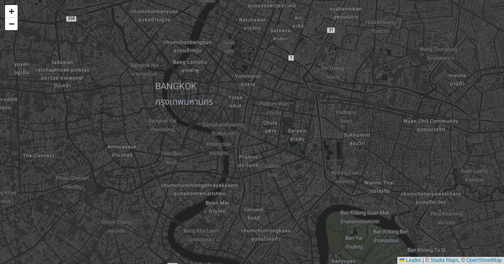

# scripts/bangkok-citywalk



Generates the Bangkok city-walk map: reads `venues.csv`, geocodes venues
(cached in `.geocache.json`), downloads photos from Wikimedia Commons, and
writes GeoJSON. A Remotion project (`remotion/`, `render-walk.js`) renders a
video version of the walk.

## Run

```bash
uv run scripts/bangkok-citywalk/generate.py            # full run
uv run scripts/bangkok-citywalk/generate.py --dry-run  # preview without writing
```

**Input:** `scripts/bangkok-citywalk/venues.csv`
**Output:** `static/bangkok-citywalk/` GeoJSON + photos
**Live map:** https://maps.girard-davila.net/bangkok-citywalk/
