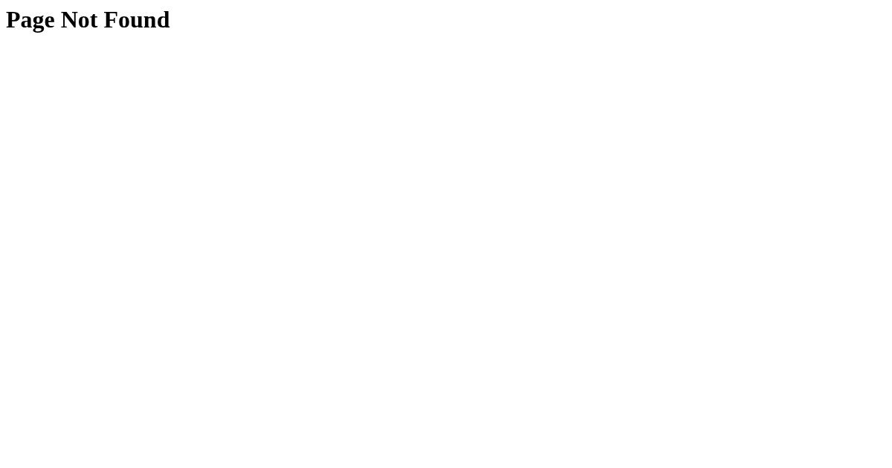

# scripts/bangkok-raco



Pipeline for the Bangkok RA.co (Resident Advisor) weekly event maps.

## Scripts

- `generate.py` — builds this-week / next-week GeoJSON and Hugo content stubs
  from RA.co event data; auto-updates `venues.csv` and reports
  `unmatched-venues.txt`.
- `ingest.py` — fetches YouTube and SoundCloud media for event artists
  (needs `YOUTUBE_API_KEY` in `.env`, falls back to scraping).
- `geocode.py` — geocodes venues.
- `curation_web.py` — local Flask UI (http://localhost:5020/) to curate
  artists' SoundCloud tracks.

## Run

```bash
uv run scripts/bangkok-raco/generate.py [--dry-run]
uv run scripts/bangkok-raco/ingest.py [--dry-run]
uv run scripts/bangkok-raco/curation_web.py
```

**Outputs:** `static/bangkok-raco/events/{this,next}-week.geojson`,
`content/bangkok-raco-{this,next}-week/_index.md`
**Live maps:** https://maps.girard-davila.net/bangkok-raco-this-week/ ·
https://maps.girard-davila.net/bangkok-raco-next-week/
**Upstream data:** produced by [`scripts/raco`](../raco/README.md).
