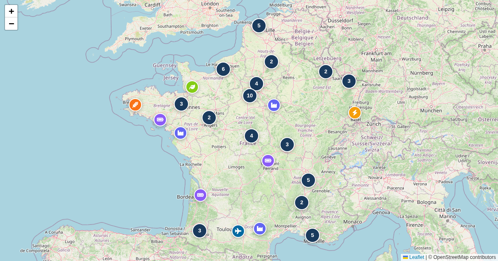

# scripts/france_project_newsletter

Newsletter pipeline monitoring France's strategic industrial projects
(France 2030). Discovers news sources per company, classifies items with a
local LLM, and sends digests — while enriching the
[grands projets map](https://maps.girard-davila.net/france-grands-projets-strategiques/).

## Pipeline

1. `init_db.py` — create the SQLite DB.
2. `enrich_france2030.py`, `enrich_pappers.py`, `enrich_web.py`,
   `enrich_geojson.py` — enrich company/project metadata and the map GeoJSON.
3. `discover_sources.py --type {bodacc_rss,google_news_query_rss,youtube_channel_rss,linkedin_company_rss,all}`
   — propose RSS sources, reviewed via the Telegram bot before activation.
4. `fetch_digest.py` → `classify.py` — fetch feed items, then LLM relevance
   filter + signal classifier (llama.cpp server, see `config.toml`; degrades
   gracefully if unreachable).
5. `extract_finance.py`, `send_mailchimp.py` — extract financial signals,
   send the newsletter.
6. `telegram_bot.py` — human review loop; `run_pipeline.sh` — orchestrates a
   full run (see `systemd/` for service units, `docker/rsshub.yml` for the
   RSS bridge).

## Configuration

`config.toml` — LLM server URL, changedetection.io instance, etc.
Infra: llama.cpp on `fami`, changedetection.io + cron on `lamai270`.

**Output:** `static/france-grands-projets-strategiques/locations.geojson`
enrichment + Mailchimp newsletter
**Live map:** https://maps.girard-davila.net/france-grands-projets-strategiques/
