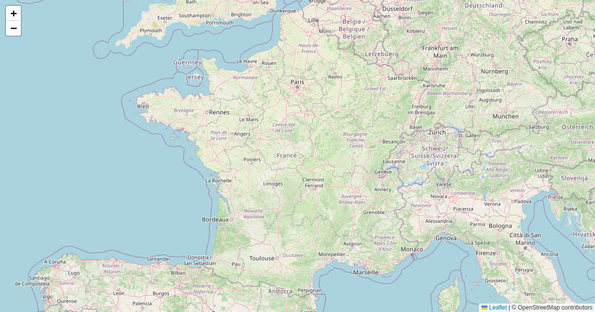

# scripts/revente-tickets-fr



Ticket-resale tracker for r/ReventeTicketsFR: fetches VENTE posts from Reddit,
notifies via Telegram, tracks sold signals, and publishes confirmed listings
to a map.

## Scripts

- `init_db.py` — creates the SQLite state DB (`data/revente-tickets-fr/state.db`).
- `fetch_posts.py` — cron job: pulls new posts via Reddit API (praw), sends
  Telegram notifications, polls listings for sold signals.
- `telegram_bot.py` — persistent bot service: confirm/reject listings from chat.
- `generate.py` — rebuilds the map GeoJSON from SQLite state (also called by
  the bot after each confirmation).

## Run

```bash
uv run scripts/revente-tickets-fr/init_db.py       # once
uv run scripts/revente-tickets-fr/fetch_posts.py   # cron (daily)
uv run scripts/revente-tickets-fr/telegram_bot.py  # long-running service
uv run scripts/revente-tickets-fr/generate.py      # rebuild GeoJSON manually
```

Requires in `.env`: `REVENTE_BOT_TOKEN`, `REVENTE_CHAT_ID`,
`REDDIT_CLIENT_ID`, `REDDIT_CLIENT_SECRET`, `REDDIT_USER_AGENT`,
optional `YOUTUBE_API_KEY`.

**Output:** `static/revente-tickets-fr/` GeoJSON
**Live map:** https://maps.girard-davila.net/revente-tickets-fr/
