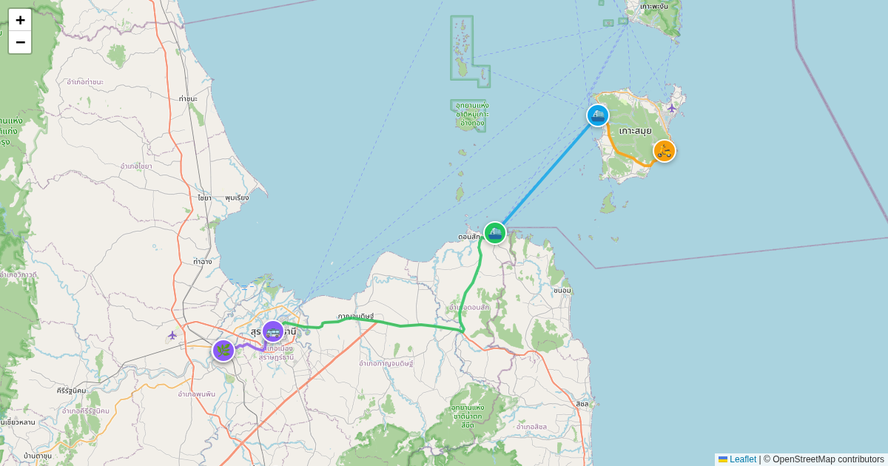

# scripts/surat-thani-koh-samui-transit



Generates the Surat Thani ↔ Koh Samui transit itinerary map from a hardcoded
list of stops (taxi pickup, ferry piers, train station) with per-leg notes,
contacts, and booking links.

## Run

```bash
uv run scripts/surat-thani-koh-samui-transit/generate.py
```

No external dependencies (stdlib only). Edit the `STOPS` list in
`generate.py` to change the itinerary, then re-run.

**Output:** `static/surat-thani-koh-samui-transit/locations.geojson`
**Live map:** https://maps.girard-davila.net/surat-thani-koh-samui-transit/
