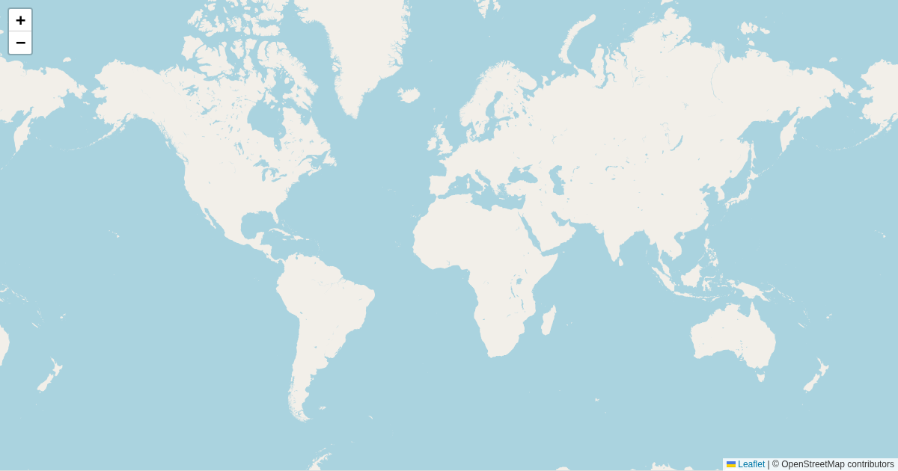

# scripts/temple-walk



Generates self-guided Buddhist temple walking tours: finds named temples via the
OSM Overpass API, chains them into a walking route with OSRM foot-routing, pulls
photos from Wikimedia Commons, and writes a GeoJSON + Hugo content page that
renders as an interactive map (`layouts/temple-walk/single.html`).

### Prerequisites

- [`uv`](https://docs.astral.sh/uv/) — both scripts are self-contained (`uv run --script`), deps are declared inline
- Network access to Overpass, OSRM, Nominatim (address geocoding), and Wikimedia Commons

### `generate.py`

Finds named Buddhist temples near a starting point, chains them greedily with
OSRM walking legs, and stops before the cumulative distance exceeds `--max-km`.
Output follows the bangkok-citywalk GeoJSON schema.

```bash
uv run scripts/temple-walk/generate.py --start "13.7516,100.4927" --slug rattanakosin
uv run scripts/temple-walk/generate.py --start "Democracy Monument, Bangkok" --slug democracy --max-km 8
uv run scripts/temple-walk/generate.py --start "13.7516,100.4927" --slug rattanakosin --dry-run
```

| Option | Default | Notes |
|---|---|---|
| `--start` | *(required)* | `"lat,lng"` or an address (geocoded via Nominatim) |
| `--slug` | *(required)* | output identifier, used in all paths |
| `--max-km` | `10` | walking-distance budget |
| `--dry-run` | off | print planned actions, no network writes; requires a `"lat,lng"` start |

### `multi.py`

Runs the same walk-planning logic stochastically N times from one starting
point, producing a combined GeoJSON for exploring route variations
(`layouts/temple-walk-multi/single.html`). Shares the Overpass/OSRM cache with
`generate.py`. Never fetches photos.

```bash
uv run scripts/temple-walk/multi.py --start "13.7516,100.4927" --slug rattanakosin
uv run scripts/temple-walk/multi.py --start "13.7516,100.4927" --slug rattanakosin --runs 30 --max-km 10
```

| Option | Default | Notes |
|---|---|---|
| `--start` | *(required)* | `"lat,lng"` or an address |
| `--slug` | *(required)* | output identifier, shared with `generate.py` |
| `--runs` | `20` | number of walks to generate |
| `--max-km` | `10` | walking-distance budget per walk |

### Output

- `static/temple-walks/<slug>/walk.geojson` — temple stops (name, photos, per-photo
  attribution, cumulative distance), start point, and route `LineString`
- `static/temple-walks/<slug>/photos/` — downloaded Wikimedia Commons images (`generate.py` only)
- `content/temple-walks/<slug>.md` — Hugo content stub (front matter: `title`,
  `description`, `type: temple-walk` or `temple-walk-multi`, `geojson` path);
  left untouched by re-runs if it already exists

### Caching

Overpass responses and OSRM route legs are cached per-slug under
`scripts/temple-walk/cache/` (`<slug>.overpass.json`, `<slug>.routes.json`,
`<slug>.media.json`) so re-running with the same `--slug` doesn't re-hit the
network for unchanged legs.

### Tests

```bash
uv run --with pytest pytest scripts/temple-walk/tests/
```
