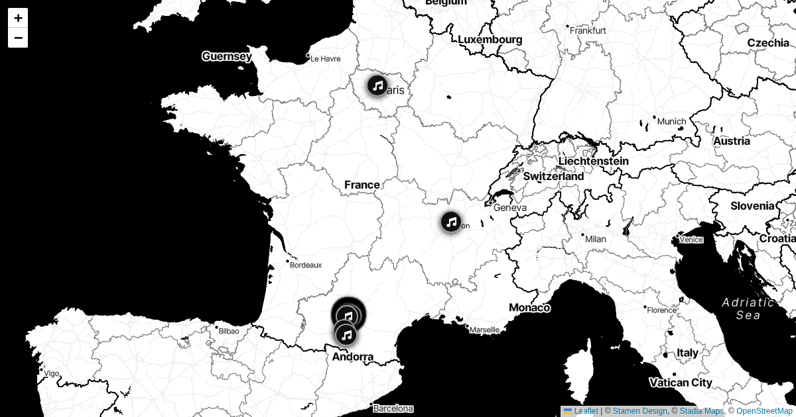

# toulouse-distorama scripts



Data pipeline for the Distorama underground map of Toulouse.
Source: [distorama.neocities.org](https://distorama.neocities.org)

## Workflow

```
ingest.py → review.py → generate.py
```

### 1. Venue classification (one-time / on new unmatched venues)

```sh
uv run scripts/toulouse-distorama/classify.py
```

Reads `unmatched-venues.txt` (produced by `generate.py`) and lets you interactively assign each raw venue name to a known entry in `venues.csv`, or mark it as a non-match. Updates `venues.csv` and `venues_nomatch.csv` in place.

Run this whenever `generate.py` reports new unmatched venue names.

---

### 2. Media ingest

```sh
uv run scripts/toulouse-distorama/ingest.py
```

Fetches `events.json` from distorama.neocities.org, extracts artist names, then searches YouTube and Bandcamp for each artist not yet in `.mediacache.json`.

Results are written incrementally to `.mediacache.json` as each artist is processed.

**Environment variables** (set in `.env` at the repo root):

| Variable | Required | Description |
|---|---|---|
| `YOUTUBE_API_KEY` | No | YouTube Data API v3. Falls back to page scraping if absent (scrape results are never auto-validated). |
| `SERPAPI_API_KEY` | No | SerpAPI for Bandcamp search. Bandcamp enrichment is skipped if absent. |

**YouTube curation (scored, conservative):** with `YOUTUBE_API_KEY` set, each artist's top ~8 YouTube results are fetched (search + statistics) and scored on title signals (live/performance keywords, artist-name match, view count). The best candidate is stored as `youtube_video_id` along with the full ranked list in `youtube_candidates`.

Auto-validation happens **only** when all of the following hold (otherwise the artist stays unvalidated for `review.py`):

- top candidate scores ≥ 4.5,
- it beats the runner-up by ≥ 1.5 points (clear margin),
- it carries a live/performance signal (title term like `live`/`concert`/`session`, or an official-channel match).

Artists whose YouTube id was rejected in `review.py` are re-searched automatically (their rejected ids are excluded from future candidates).

---

### 3. Media review

```sh
uv run scripts/toulouse-distorama/review.py
# → http://localhost:5020
```

Browser UI for validating the YouTube and Bandcamp results found by `ingest.py`. Opens one artist at a time; only media approved here will appear on the maps.

**Keyboard shortcuts:**

| Key | Action |
|---|---|
| `1` | Approve YouTube |
| `2` | Reject YouTube |
| `4` | Approve Bandcamp |
| `5` | Reject Bandcamp |
| `← →` or `Space` | Navigate |

Artists with scored candidates show a ranked candidate list under the player (score, channel, views). Clicking a candidate loads it in the iframe and moves it to the top — then approve/reject it as usual. An `auto` badge marks videos approved automatically by `ingest.py`.

**Filter buttons** (top of page):

- **Pending** — artists with at least one unvalidated result (default)
- **Has media** — all artists with a YouTube ID or Bandcamp URL
- **All** — every entry in `.mediacache.json`

Rejected IDs/URLs are stored in `youtube_rejected_ids` / `bandcamp_rejected_urls` so `ingest.py` never re-proposes them.

---

### 4. GeoJSON generation

```sh
uv run scripts/toulouse-distorama/generate.py
uv run scripts/toulouse-distorama/generate.py --dry-run   # no writes
```

Fetches `events.json`, resolves venues, and writes all GeoJSON files and Hugo content stubs. Reads `.mediacache.json` but never modifies it — only **validated** media (approved in `review.py`) is embedded in the output.

**Outputs:**

| Path | Description |
|---|---|
| `static/toulouse-distorama/locations.geojson` | All venues (static map) |
| `static/toulouse-distorama/events/YYYY-MM-DD.geojson` | Per-day event maps |
| `static/toulouse-distorama/events/YYYY-MM.geojson` | Per-month rollups |
| `static/toulouse-distorama/events/this-week.geojson` | Current ISO week |
| `static/toulouse-distorama/events/next-week.geojson` | Next ISO week |
| `content/toulouse-distorama-*/` | Hugo content stubs |
| `scripts/toulouse-distorama/unmatched-venues.txt` | Venue names not found in `venues.csv` |

---

## Data files

| File | Description |
|---|---|
| `venues.csv` | Registry of known venues: name, address, category, logo, URL, plus an optional `aliases` column (pipe-separated display-name variants that map to the same venue) |
| `venues_nomatch.csv` | Venue names confirmed as non-matches (excluded from maps) |
| `unmatched-venues.txt` | Raw venue names from latest `events.json` not yet classified |
| `.geocache.json` | Address → coordinates cache (Nominatim) |
| `.mediacache.json` | Artist → YouTube/Bandcamp cache, including validation state and ranked `youtube_candidates` |

## Typical update cycle

```sh
# Pull fresh events and enrich new artists
uv run scripts/toulouse-distorama/ingest.py

# Validate new media results in the browser
uv run scripts/toulouse-distorama/review.py

# Regenerate all GeoJSONs and Hugo stubs
uv run scripts/toulouse-distorama/generate.py

# If generate.py reported new unmatched venues, classify them
uv run scripts/toulouse-distorama/classify.py
```

---

## Slideshow (YouTube Shorts)

`capture-slideshow.js` produces a 1080×1920 MP4 suitable for YouTube Shorts. It drives a headless Playwright browser through the `/toulouse-distorama-slideshow/` Hugo page, records the video track, then builds and mixes the audio track with ffmpeg using audio pulled from the venue YouTube clips.

**Prerequisites:** `node`, `playwright` (`npm i playwright`), `yt-dlp`, `ffmpeg`, Hugo available on `$PATH`.

The script reads `static/toulouse-distorama/events/this-week.geojson` — run `generate.py` first.

### Fresh capture

```sh
node scripts/toulouse-distorama/capture-slideshow.js
```

Outputs three files in `static/toulouse-distorama/slideshows/`:

| File | Description |
|---|---|
| `distorama-week-{N}_{hash}.mp4` | Final encoded video |
| `distorama-week-{N}_{hash}.csv` | Timestamp log: `timestamp,artist,venue,video_id` |
| `distorama-week-{N}_{hash}.state.json` | Full capture state for remix |
| `distorama-week-latest.mp4` | Symlink → latest MP4 |
| `distorama-week-latest.csv` | Symlink → latest CSV |

**Disk usage:** `slideshows/` accumulates ~40–65 MB per render (plus `--timestamp-offsets` sweeps). It is gitignored. Clean up manually when needed — keep the 2 newest final renders:

```sh
cd static/toulouse-distorama/slideshows
ls -t distorama-week-*_*.mp4 | grep -v _ts | tail -n +3 | xargs rm -f
```

### Remix (redo audio without re-capturing)

```sh
node scripts/toulouse-distorama/capture-slideshow.js \
  --remix static/toulouse-distorama/slideshows/distorama-week-{N}_{hash}.state.json \
  [options]
```

| Option | Default | Description |
|---|---|---|
| `--clip-offset <s>` | `30` | Seconds into each source clip to start audio |
| `--fade-out <s>` | `2` | Audio fade-out duration per venue slide |
| `--intro-dur <s>` | `3` | Intro silence duration (unused when `--youtube-url` set) |
| `--outro-dur <s>` | `5` | Outro silence duration |
| `--output <path>` | state value | Write remix to this path |
| `--youtube-url <url>` | — | YouTube URL whose audio fills the intro (fade-in) and outro (fade-out) |
| `--timestamp-offsets <csv>` | — | Batch mode: generate one file per offset value, e.g. `-1.5,-1,-0.5,0,0.5,1,1.5` |

### Tuning audio alignment

If the audio feels early or late relative to the video, use `--timestamp-offsets` to sweep values and compare:

```sh
node scripts/toulouse-distorama/capture-slideshow.js \
  --remix path/to.state.json \
  --timestamp-offsets -2,-1.5,-1,-0.5,0,0.5,1
```

Each value shifts the start of the first audio segment by that many seconds (positive = later, negative = earlier). The default baked-in correction is `-1.5s`.
