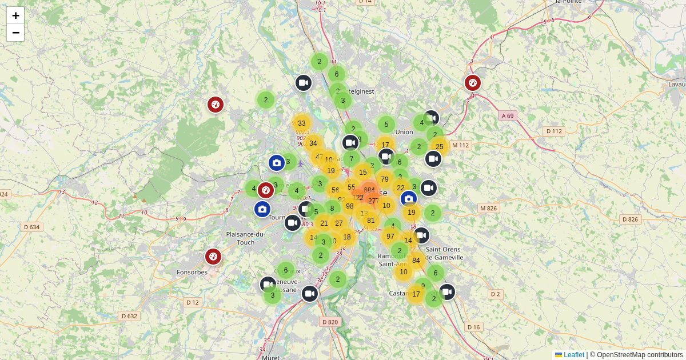

# scripts/videoprotection_toulouse



Fetches surveillance cameras and speed radars in Toulouse from OpenStreetMap
(Overpass API) and outputs GeoJSON.

## Run

```bash
uv run scripts/videoprotection_toulouse/fetch_videoprotection_toulouse.py > static/videoprotection-toulouse/locations.geojson
```

No external dependencies (stdlib only). Also run automatically by
`scripts/fetch_all.sh`.

**Output:** `static/videoprotection-toulouse/locations.geojson`
**Live map:** https://maps.girard-davila.net/videoprotection-toulouse/
