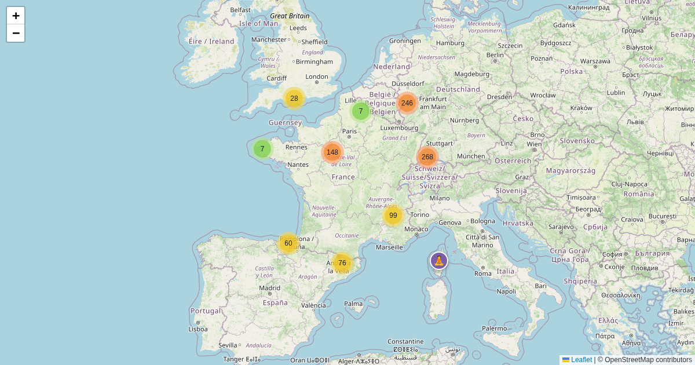

# scripts/yoga_france



Fetches all yoga places in France from OpenStreetMap (Overpass API) and
outputs GeoJSON.

## Run

```bash
uv run scripts/yoga_france/fetch_yoga_france.py > static/yoga-france/locations.geojson
```

No external dependencies (stdlib only). Also run automatically by
`scripts/fetch_all.sh`.

**Output:** `static/yoga-france/locations.geojson`
**Live map:** https://maps.girard-davila.net/yoga-france/
